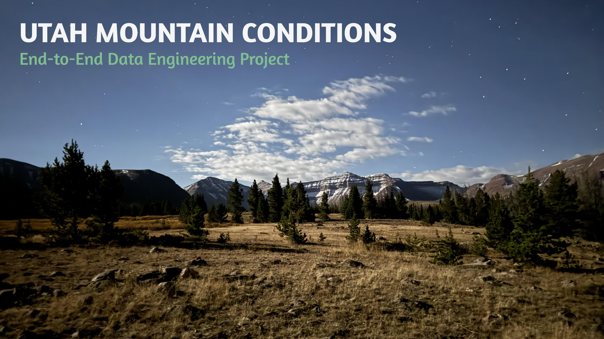
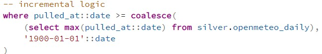

*A photo I took of King's Peak wayyyy in the center background. This is Utah's tallest mountain standing at an elevation of 4125m (13,528ft)!*


## Welcome!
This project showcases the movement of data from online sources to visual dashboards tracking mountain peak conditions for the 50 highest summits in Utah. Besides being able to explore more of my love for the mountains, I also designed this portfolio project to increase my skills and develop best practices in data engineering and analytics. Explore and enjoy! 


## How It Works?
Let me first walk you through the flow of this project and its end goal...


### Data Flow


### Incremental Logic
I used incremental processing during bronze-to-silver transformations to efficiently handle new data without creating duplicates. The logic compares the 'pulled_at' timestamp from the bronze table against the max 'pulled_at' in the silver table using a '>=' filter, ensuring no records are missed when multiple pulls share the same timestamp. 

The script also provides upsert behavior rules. This allows the pipeline to safely rerun without creating duplicate records and preserving historical forecast data across different pull dates.



### Apache Airflow Orchestration
xxxxxxx.

### Insights
xxxxxxx.

### Decision Making
xxxxxxx.


## Data Architecture
The database follows the **medallion architecture** style. Data is first stored raw, then transformed, and finally loaded into tables/views ready for analysis and visualizations.


1. **Bronze** -- Raw data is ingested from external APIs and stored in the Bronze schema exactly as received (usually in JSON form).
2. **Silver** -- The raw data is cleaned, standardized, and normalized. This layer removes noise, fixes inconsistencies, and prepares the data for modeling. 
3. **Gold** -- Fully transformed data is organized into dimensional and fact tables. This layer is optimized for analytics, dashboards, and downstream reporting.


## Tools & Technologies

**Python**: Connecting to APIs, Extract Transform Load processes.

**PostgreSQL**: Creating database, schemas, tables. Extract Load Transform processes.

**R**: Visualizations.

**Power BI Desktop**:

**Apache Airflow**:


## Repository Structure

```py
Utah-Mountain-Conditions-DE/
│
├── Wiki Data/                          # Saved CSVs of the top 50 tallest utah mountains table extract from wikipedia 
│
├── Docs/                               # Project documentation and architecture details
│   ├── Kings.Peak.jpg                  # Project photo
│   ├── DWH Layers.png                  # Diagram showing the medallion architecture used for this project
│   ├── Data Flow.png                   # Diagram showing the flow of data
│   ├── Data Sources.doc                # Doc listing the data sources used with URLs 
│   ├── Project Goals.doc               # Personal learning goals for this project
│
├── Scripts/                            # Scripts for ETL/ELT processes and analyses
│   ├── Python                          # Python scripts
│   ├── SQL                             # SQL scripts
│   ├── R                               # R scripts
|
├── README.md                           # Project overview and details
├── .gitignore                          # Private info to be ignored by git
└── requirements.txt                    # Dependencies and requirements used for the project
```

## Author

**Tavish King**

Data Analyst/Jr. Data Engineer

Feel free to connect on [LinkedIn](https://www.linkedin.com/in/tavish-king/) or check out more of my work!


