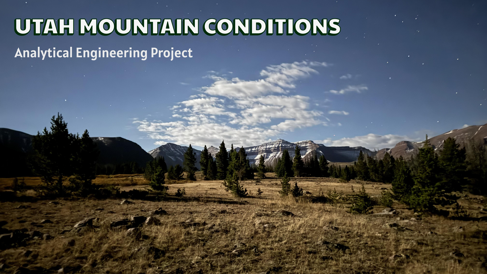
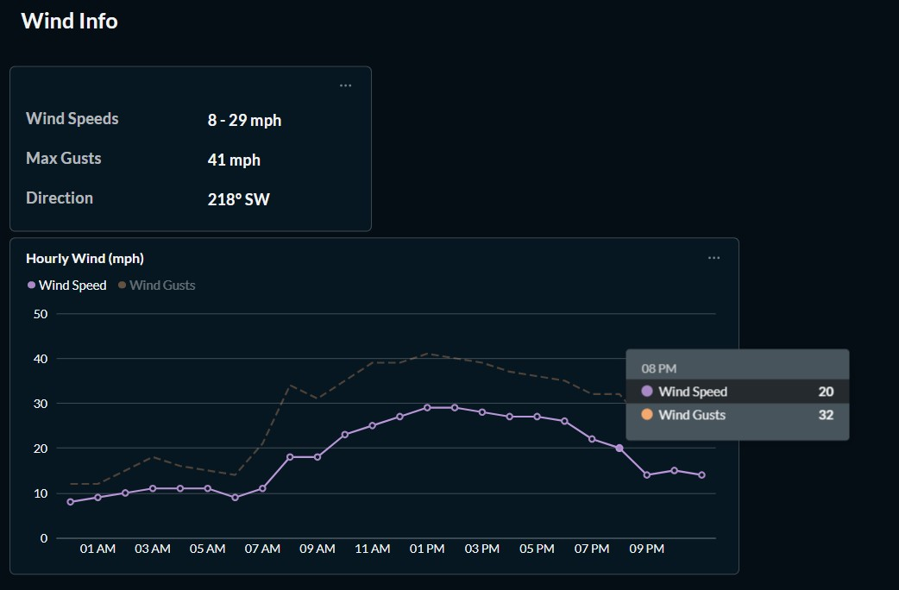

*Utah's tallest mountain, **King's Peak** (background), stands at an elevation of 4125m (13,528ft)!*


## Welcome!
This project demonstrates an end-to-end analytical engineering pipeline that tracks weather conditions across Utah's 50 highest mountain peaks (and more). By pulling real-time forecasts from multiple APIs and transforming them into analytics-ready datasets, my project showcases skills in ETL development, database design, workflow orchestration, statistical analysis, and data visualization. 

Besides being able to explore more of my love for the mountains, I also designed this portfolio project to increase my skills and develop best practices in analytical engineering and data analysis. Explore and enjoy! 


## How It Works?

### Data Architecture
The database follows the **multi-layered architecture** isnpired by the medallion. Data is first stored raw, then transformed, and later loaded into tables/views ready for analysis and visualizations when the need arrives.


### Data Flow


**Data Sources:**
- **Wikipedia**: Top 50 Highest Summits/Mountains in Utah + more
- **Weather Codes**: https://gist.github.com/stellasphere/9490c195ed2b53c707087c8c2db4ec0c
- **OpenMeteo API**: Daily (7-day forecast), Hourly (24-hour forecast), and 15-minute Lightning Potential data
- **OpenWeather API**: Live weather alerts

### Data
The complete data catalog can be found in these markdown files:

- [Bronze Schema](Docs/diagrams/bronze_schema.md)
- [Silver Schema](Docs/diagrams/silver_schema.md)

### Incremental Logic
All bronze-to-silver transformations use incremental processing to efficiently handle new data while preventing duplicates. The pipeline compares the `pulled_at` timestamp from bronze against the maximum `pulled_at` in silver using a `>` filter, ensuring no records are missed when multiple pulls share the same timestamp.

This approach allows the pipeline to safely rerun without creating duplicates while preserving forecast trends.


### Apache Airflow Orchestration

**`mtn_conditions_dag.py`** = Runs automatically at 1am every night. Python ETL & SQL load scripts are treated as tasks. 2 retries are attempted with 5-minute delay between each task to prevent hitting the API too hard.

**`load_task_instances.py`** = Runs automatically at 4am every night. Fetches all task instances across all DAGs. Upserts them into `meta.task_instances`. 

**`test_db_conn`** = Runs on manual trigger to test database connection. Runs a simple script to verify in Logs.


### Insights


*Metabase allows me to visualize wind info that I've collected and cleaned*


## Tools & Technologies

**Python 3.14.0**: API extraction, data validation, error handling.

**PostgreSQL 18**: Relational database with JSONB support for semi-structured data, incremental load patterns.

**SQL**: Complex transformations including JSON parsing, array unnesting, window functions, upserts. pgAdmin 4.

**Apache Airflow**: Workflow orchestration, scheduling, dependency management, monitoring.

**Metabase**: Free dashboard tool to visualize, filter, and use my data pre-hike.

**R**: Statistical analysis and visualizations.

**Git/GitHub**: Version control and project documentation.

## Get Started


## Repository Structure

```py
Utah-Mountain-Conditions-DE/
|
├── config/                     # hidden airflow.cfg file
├── plugins/                    # airflow plugins
|
├── dags/                       # DAG scripts used to schedule data ETL processes
│
├── Docs/                       # Project documentation and architecture details
│   ├── images/                 # Project photos + images
│   ├── diagrams/               # Diagrams
│   ├── airflow+practice/       # airflow practice templates to refer to
│   ├── notes/                  # Doc listing the data sources used with URLs 
│   ├── .gitkeep                # 
│
├── Scripts/                    # Scripts for ETL/ELT processes and analyses
│   ├── Python                  # Python scripts
│   ├── SQL                     # SQL scripts
│   ├── R                       # R scripts
|
├── weather_codes/              # weather code json file
|
├── README.md                   # Project overview and details
├── .gitignore                  # Private info to be ignored by git
├── requirements.txt            # Dependencies and requirements used for the project
├── docker-compose.yaml         # Docker Compose file to define airflow container 
├── .env.example                # .env example with how I set up my hidden .env 
├── wiki_mtns.csv               # File containing all current mountains collecting data in the project    
```

## Author

**Tavish King**

Data Analyst/Jr. Analytics Engineer

Feel free to connect on [LinkedIn](https://www.linkedin.com/in/tavish-king/) or check out more of my work!